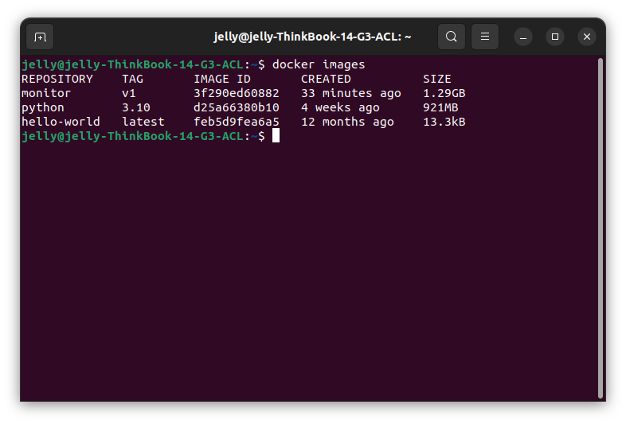

# Document of the Monitoring System for Developers

This project is called `Monitor`. It is developed on Linux. It uses a screenshot of the webcam as the input, and it will output a JSON file called `cubeLocation.json`, which stores all cubes that the two arms are able to grab. In `cubeLocation.json`, each cube is recorded as an array with a length of 4 (i.e. [x distance relative to the arm in mm, y distance relative to the arm in mm, height in mm, rotation angle (0-90)]).

**Important: to run the monitoring system, you MUST have a screenshot of the webcam, name it as `img.png`, and put it in the project folder `Monitor`.**


## Run the system 

There are 2 ways to run the system: you can either directly run it via `src/main.py`, or run it in Docker.


#### Directly run the system via `src/main.py`.

You can directly run the system by

```
python3 src/main.py
```

Then you can see the created `cubeLocation.json` in the folder `Monitor`. 

In addition, you can see two additional generated pictures: `img_undistorted.pic` shows the undistorted `img.png`, and `img_undistorted.pic` visualizes all detection cubes (see the figure below), and some auxiliary lines/areas, to help debug.


#### Run the system in Docker

To deploy the system, you have to run the system in docker. Below are the four steps.


First, you need to install  `parallel` on the targeting machine by entering the following command.

```
sudo apt-get -y install parallel
```


Second, you have to change the path of `WORKDIR` in the `Dockerfile`.

Open the `Dockerfile`, you can find a line with `WORKDIR `. For example, I put the `monitor` folder on my Desktop (`/home/jelly/Desktop`), therefore my `WORKDIR ` should be written as:

```
WORKDIR /home/jelly/Desktop/Monitor
```

You should change the path of `WORKDIR` according to your own settings. (you must use the absolute path here)


Third, we input the following command to build a docker image called `monitor:v1`

```
docker build -t monitor:v1 .
```

After successfully running this command, you will see a docker image called `monitor` with the tag `v1`.




Now, the docker image has been build.


Finally, we input the following command to start the monitoring system.

```
# Switch the directory to your WORKDIR. 
# For example, the below command is: `cd /home/jelly/Desktop/Monitor` on my computer.
cd ${WORKDIR}   
parallel sh ::: scripts/run_docker.sh scripts/update_pic.sh
```

After successfully running this command, a new file `cubeLocation.json` will be generated in the project folder `Monitor`.


## The project structure

Below we list contents of directories in a tree-like format.

```
Monitor
├── dev_document_img 
├── dev_document.md
├── Dockerfile
├── pic.png
├── requirements.txt
├── scripts
│   ├── run_docker.sh
│   └── update_pic.sh
└── src
    ├── assignArms.py
    ├── converting.py
    ├── cubeCorrection.py
    ├── detection.pydetection_img
    ├── drawing.py
    ├── inInvalidAreas.py
    ├── __init__.py
    ├── inQuadrilateralArea.py
    ├── isOnTrack.py
    ├── main.py
    ├── numpyArrayEncoder.py
    ├── points.py
    └── undistortion.py
```

Role of each folder:

- dev_document.md: this file.
- dev_document_img: store the pictures of dev_document.md.
- Dockerfile: a text document that contains all the commands to assemble a docker image.
- pic.png: the real-time screenshot got from the webcam.
- requirements.txt: it includes the necessary packages, and it is called by the Dockerfile.
- scripts: store two shell scripts that can start our monitoring system.
- src: store the source code of the project.


The following picture show the overall relationship of each file in the `src` folder.


Some explanations:

- The system starts from `main.py`.
-  `main.py` calls `undistortion.py` to undistort the camera. The undistorted picture is then returned to `main.py`.
- After that, `main.py` calls `detection.py` to detect the cubes from the undistorted picture.
- `detection.py` calls `cubeCorrection.py` to slightly correct the location of cubes.
- Next, `detection.py` calls `isOnTrack.py` to judge whether a cube is on the track. Also, `detection.py` calls `inInvalidAreas.py` to remove the detected red tapes. Both `isOnTrack.py` and `inInvalidAreas.py` are based on `inQuadrilateral.py`.
- Then, `detection.py` calls `drawing.py` to draw some points and areas. (Note: `drawing.py` is only used for debugging and visualization, it does not affect the detecting result.)
- Later, `detection.py` calls `converting.py` to convert the set of detected cubes from list to array.
- Next, `detection.py` calls `assignArm.py`  to assign cubes to two arms.
- `assignArm.py` also calls `converting.py` to convert the location of points from pix to millimeter.
- At last, `assignArm.py` also calls `numpyArrayEncoder.py`  to export the detection result as `cubeLocation.json`. 


Last but not least, `points.py` stores all the static points in the webcam (e.g. the corners of the tracks, the central points of the two arms, etc.). You can change the location of points in `points.py` if required.
